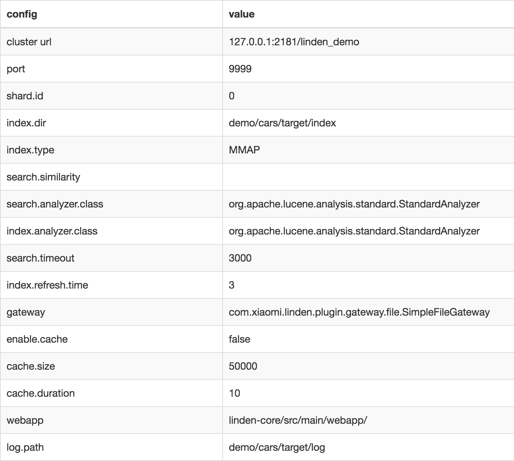
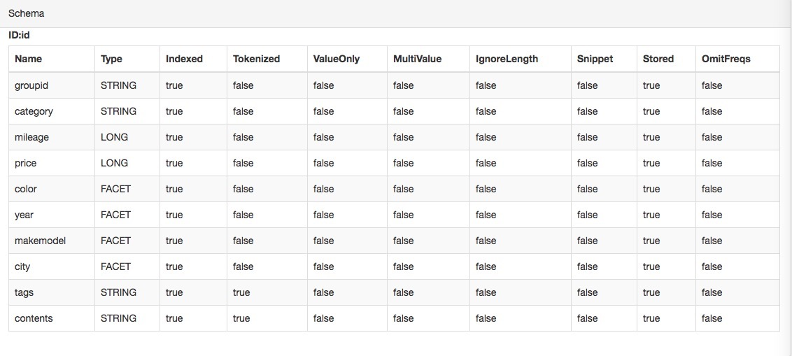

###Get started
*	git clone git@github.com:XiaoMi/Linden.git
*   cd to root directory of linden source code
*  `$ mvn clean package -DskipTests`
*  `$ sh ./bin/start-zk-server.sh &` or run `> .\bin\start-zk-server.cmd`  in windows OS
*  `$ sh ./bin/start-linden-server.sh demo/cars/conf/`  or  run `> .\bin\start-linden-server.cmd  demo/cars/conf/` in windows OS
*   Access  [http://localhost:10000](http://localhost:10000) and play the demo

###Demo config
[http://localhost:10000/#/config/](http://localhost:10000/#/config/) displays this demo configuration

*	Runtime Status
	

*	Linden Properties (from demo/cars/conf/properties)
	

*	Linden Schema
   

This demo index is from demo/cars/data/cars.json.  There is 15000 cars data in JSON format in this file,  for example

    {
        "id":0,
        "groupid":"0",
        "tags":"hybrid,leather,moon-roof,reliable",
        "category":"compact",
        "mileage":14900,
        "price":7500,
        "contents":"yellow compact hybrid leather moon-roof reliable u.s.a. florida tampa asian acura 1.6el ",
        "color":"yellow",
        "year":1994,
        "makemodel":"asian/acura/1.6el",
        "city":"u.s.a./florida/tampa"
    }
*	Linden schema must contain an ID field, this field is string type, ID field in document stores a unique string to indicate the identification of this document.  In this demo ID field name is “id”
* 	groupid and category are string type fields
*	tags and contents are string type fields but tokenized
*	mileage and price are long type fields which store a long type value
*	color, year, makemodel and city are facet type fields which can be used in facet search.   See [http://lucene.apache.org/core/4_0_0/facet/org/apache/lucene/facet/doc-files/userguide.html](http://lucene.apache.org/core/4_0_0/facet/org/apache/lucene/facet/doc-files/userguide.html)

###Play the Demo
Play the demo in [http://localhost:10000/#/search/](http://localhost:10000/#/search/)
Here are some sample BQL queries you can try:

	select * from linden source
	select * from linden by query is "tags:electric" source explain
	select * from linden by query is "tags:electric" where color='green' and price < 5000 source
	select * from linden browse by color(3) source
	select * from linden where price > 15000 browse by makemodel(5, 'asian') source
	select * from linden browse by makemodel(5, 'european/audi') source
	select * from linden browse by color(3) drill down makemodel('european/audi')  source
	select * from linden browse by color(3), makemodel drill sideways makemodel('european/audi')  source
	select * from linden where category='luxury' aggregate by price({*, 5000}, [5000, 10000}, [10000, 15000}, [15000, *}) source
	select * from linden where category='compact' aggregate by price({*, 5000}, [5000, 10000}, [10000, 15000}, [15000, *}) source
